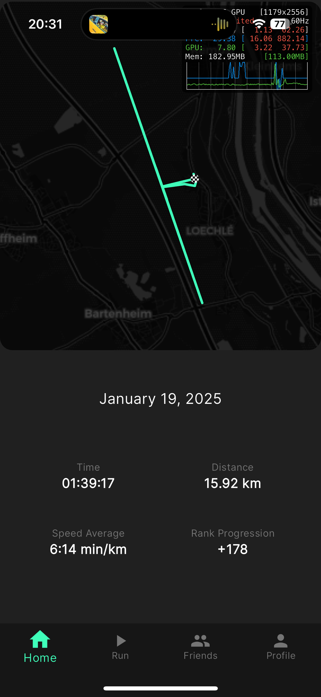

# PaceUp

PaceUp (used to be MotivateMe) is a mobile application made to keep motivation while running. Sometimes can be boring, sometimes we lack of motivation, this is the goal of this application. It allows you to share your in realtime your run with your friends. Your friends can then send you voice message to motivate you that will play automatically in your headphones during your run.

## Features/RoadMap

- **Real-Time Tracking**
   [X] Track your runs with precision using GPS. 
   [X] View live stats such as pace, distance, and time during your runs.

- **Social Engagement**
  [X] Notify your friends when you start a run.
  [X] Follow your friends' progress and cheer them on in real time.

- **Motivating Voice Messages**
 [X] Send and receive voice messages to inspire friends during their runs.
 [X] Voice messages play automatically through headphones to keep runners motivated.

- **Ranking System (WIP)**
  [X] Earn points based on your pace and progress through an animal-themed ranking system.
  [X] Compare your stats with friends and strive to be the fastest in the pack.

## Screenshots of the current status of the app
   

## Technology Stack

- **Frontend**: Flutter
- **Backend**: Firebase (Realtime database,Firestore,Authentication,Storage,Functions)
